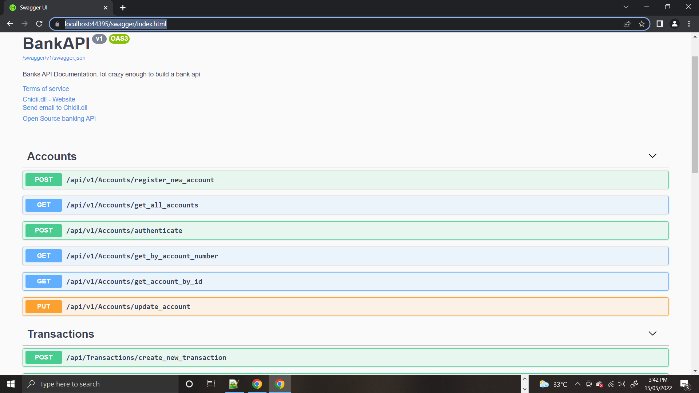
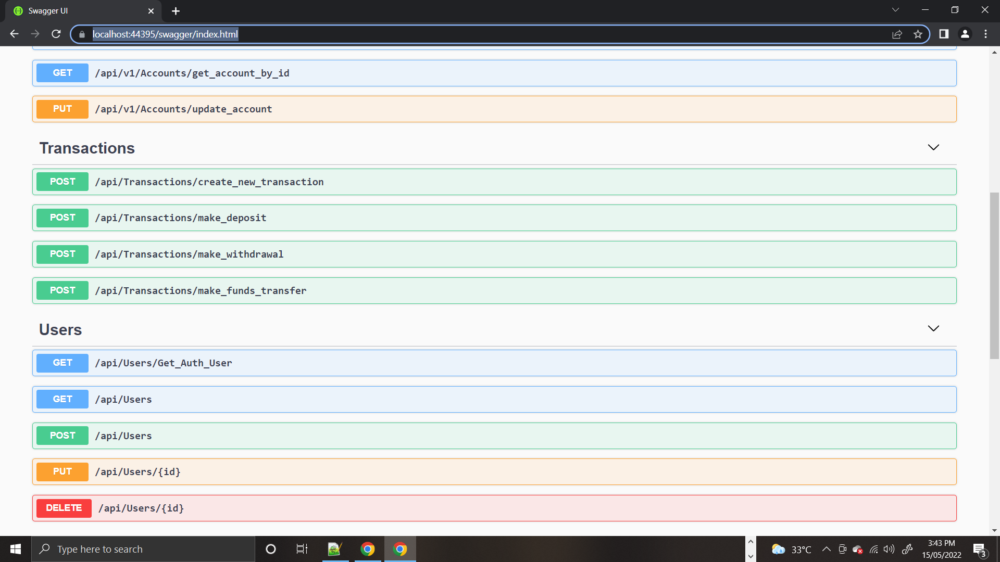

# OpenBankAPI

This is a demo bank API aimed for learning purposes and for the open source community. It encompasses major aspects of banking like accounts opening, 

 deposit of funds, funds transfer and a couple of other transactional aspects. Feel free to consume the API in your frontend projects.: some Endpoints included are:

<ol>
<li>DEPOSIT OF FUNDS</li>
<li>FUNDS WITHDRAWAL</li>
<li>FUNDS TRANSFER</li>
<li>AUTHENTICATION OF VALID ACCOUNT HOLDER</li>
<li>etc...</li>
</ol>

more amazing endpoints would be added as time goes on.

<strong>Kindly update the connection String to your own local db before running or building</strong>
### UI/UX ###

Swagger UI was used to document this API.

### IDE/Framework ###

Visual studio and Asp.net core 5.0.

# Pre-ScreenShots

